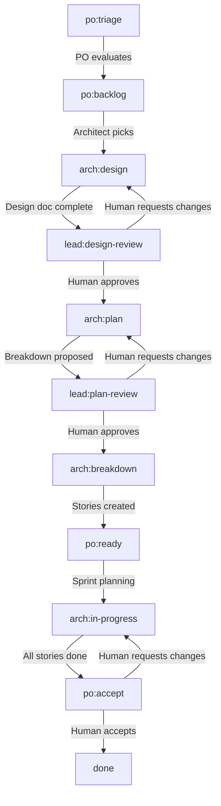
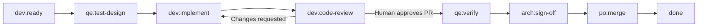

# Status Transitions

**Team:** Splat Team  
**Profile:** scrum-compact  
**Last Updated:** 2026-05-01

---

## Overview

Status is tracked via GitHub Projects v2 "Status" field (single-select dropdown). Status values follow the pattern: `<role>:<phase>`.

**Key Principle:** Superman agent self-transitions through states by wearing different hats.

---

## Epic Status Workflow



---

## Epic Status Definitions

### po:triage

**Hat:** Product Owner  
**Description:** New epic, awaiting evaluation

**Entry:** Epic issue created  
**Exit:** PO evaluates value and feasibility

**Actions:**
- Review epic description and success criteria
- Evaluate alignment with team roadmap
- Estimate rough size (small/medium/large)
- Decide: accept or reject

**Next States:**
- → `po:backlog` (accepted)
- → close issue (rejected)

**Duration:** < 1 business day

---

### po:backlog

**Hat:** Product Owner  
**Description:** Accepted, prioritized, awaiting activation

**Entry:** PO accepts epic  
**Exit:** PO assigns to architect for design

**Actions:**
- Prioritize relative to other backlog epics
- Ensure epic has clear success criteria
- Wait for capacity to start design work

**Next States:**
- → `arch:design` (PO activates)

**Duration:** Days to weeks (depends on priority)

---

### arch:design

**Hat:** Architect  
**Description:** Architect producing design doc

**Entry:** Architect starts design work  
**Exit:** Design doc complete and ready for review

**Actions:**
- Research technical approach
- Write design doc (approach, alternatives, risks, rollout plan)
- Add design doc link to epic issue body
- Create preliminary story list (rough breakdown)

**Design Doc Template:**
```markdown
## Approach
[Proposed technical solution]

## Alternatives Considered
[Other approaches and why rejected]

## Risks & Mitigations
[Known risks and how to address]

## Rollout Plan
[Phased rollout if applicable]

## Testing Strategy
[How to validate]
```

**Next States:**
- → `lead:design-review` (design doc complete)

**Duration:** 2-5 days

---

### lead:design-review

**Hat:** (Human review gate)  
**Description:** Design doc awaiting human review

**Entry:** Architect completes design doc  
**Exit:** Human approves or requests changes

**Actions (Human):**
- Review design doc
- Provide feedback via issue comments
- Approve or request changes

**Next States:**
- → `arch:plan` (human approves)
- → `arch:design` (human requests changes)

**Duration:** < 1 business day

---

### arch:plan

**Hat:** Architect  
**Description:** Architect proposing story breakdown

**Entry:** Design approved  
**Exit:** Story breakdown complete and ready for review

**Actions:**
- Break epic into implementable stories
- Write story descriptions (As a..., I want..., so that...)
- Define acceptance criteria for each story
- Estimate story points
- Identify dependencies between stories
- Add story list to epic issue (table format)

**Story List Format:**
```markdown
## Proposed Stories

| # | Title | Acceptance Criteria | Points | Dependencies |
|---|-------|---------------------|--------|--------------|
| 1 | Story A | - AC1<br>- AC2 | 3 | None |
| 2 | Story B | - AC1<br>- AC2 | 5 | Story 1 |
```

**Next States:**
- → `lead:plan-review` (breakdown complete)

**Duration:** 1-3 days

---

### lead:plan-review

**Hat:** (Human review gate)  
**Description:** Story breakdown awaiting human review

**Entry:** Architect completes story breakdown  
**Exit:** Human approves or requests changes

**Actions (Human):**
- Review proposed stories
- Verify acceptance criteria are clear
- Check dependencies make sense
- Approve or request changes

**Next States:**
- → `arch:breakdown` (human approves)
- → `arch:plan` (human requests changes)

**Duration:** < 1 business day

---

### arch:breakdown

**Hat:** Architect  
**Description:** Architect creating story issues

**Entry:** Breakdown approved  
**Exit:** All story issues created

**Actions:**
- Create GitHub issue for each story
- Add `kind/story` label
- Add `parent/<epic-number>` label
- Link to parent epic in body
- Set initial status to `dev:ready`
- Update epic with links to created stories

**Next States:**
- → `po:ready` (all stories created)

**Duration:** < 1 day

---

### po:ready

**Hat:** Product Owner  
**Description:** Stories created, epic in ready backlog

**Entry:** All stories created  
**Exit:** Sprint planning selects stories

**Actions:**
- Ensure stories are prioritized
- Wait for sprint planning
- Track as "ready for implementation"

**Next States:**
- → `arch:in-progress` (sprint starts, stories activated)

**Duration:** Until next sprint planning

---

### arch:in-progress

**Hat:** Architect  
**Description:** Architect monitoring story execution

**Entry:** Stories enter sprint  
**Exit:** All stories complete

**Actions:**
- Monitor story progress
- Unblock stories as needed
- Ensure alignment with design
- Adjust course if issues discovered

**Next States:**
- → `po:accept` (all stories done)

**Duration:** 1-3 sprints (depends on epic size)

---

### po:accept

**Hat:** (Human acceptance gate)  
**Description:** Epic awaiting human acceptance

**Entry:** All stories complete  
**Exit:** Human accepts or requests changes

**Actions (Human):**
- Review completed work
- Verify success criteria met
- Test in demo environment if needed
- Accept or request changes

**Next States:**
- → `done` (human accepts)
- → `arch:in-progress` (human requests changes)

**Duration:** < 2 business days

---

### done

**Hat:** (Terminal state)  
**Description:** Complete

**Entry:** Human accepts epic  
**Exit:** None (terminal)

**Actions:**
- Close epic issue
- Extract learnings to ADR if architectural decisions made
- Update documentation if needed

---

## Story Status Workflow



---

## Story Status Definitions

### dev:ready

**Hat:** (Initial state)  
**Description:** Story ready for development

**Entry:** Story created from epic breakdown  
**Exit:** QE hat starts test design

**Actions:**
- Ensure story has clear acceptance criteria
- Verify parent epic design is approved
- Check no blocking dependencies

**Next States:**
- → `qe:test-design`

---

### qe:test-design

**Hat:** QE (Quality Engineering)  
**Description:** QE designing tests

**Entry:** QE hat starts test design  
**Exit:** Test plan complete

**Actions:**
- Write test plan (unit, integration, e2e)
- Identify vSphere-specific test scenarios
- Define test data and environments needed
- Add test plan to story issue

**Test Plan Format:**
```markdown
## Test Plan

**Unit Tests:**
- Test case 1
- Test case 2

**Integration Tests:**
- Test case 1

**vSphere E2E Tests:**
- Test case 1 (vSphere 7.0)
- Test case 2 (vSphere 8.0)
```

**Next States:**
- → `dev:implement`

**Duration:** < 1 day

---

### dev:implement

**Hat:** Developer  
**Description:** Developer implementing

**Entry:** Test plan complete  
**Exit:** Implementation complete and PR opened

**Actions:**
- Write code following test plan
- Implement vSphere-specific logic
- Write unit tests
- Update documentation
- Open PR to upstream (or fork if testing first)

**PR Description Template:**
```markdown
## What

[Brief description]

## Why

[Rationale - link to story/epic]

## Testing

- [ ] Unit tests pass
- [ ] Integration tests pass
- [ ] vSphere e2e tests pass

Fixes #<story-number>
Parent: #<epic-number>
```

**Next States:**
- → `dev:code-review`

**Duration:** 1-3 days

---

### dev:code-review

**Hat:** (Human review gate)  
**Description:** Code review

**Entry:** PR opened  
**Exit:** Human approves or requests changes

**Actions (Human):**
- Review code quality
- Check test coverage
- Verify vSphere-specific logic correct
- Approve or request changes

**Actions (Agent while waiting):**
- Address CI failures
- Answer review questions
- Update PR based on feedback

**Next States:**
- → `qe:verify` (human approves PR)
- → `dev:implement` (changes requested - keep PR open)

**Duration:** 4-8 hours human SLA

---

### qe:verify

**Hat:** QE  
**Description:** QE verifying implementation

**Entry:** PR approved  
**Exit:** Tests pass and verification complete

**Actions:**
- Verify all tests pass (unit, integration, e2e)
- Run manual vSphere tests if needed
- Check test coverage meets standards
- Confirm vSphere-specific scenarios validated

**Next States:**
- → `arch:sign-off`

**Duration:** < 1 day (mostly automated)

---

### arch:sign-off

**Hat:** Architect (Auto-advance)  
**Description:** Architect sign-off

**Entry:** Tests pass  
**Exit:** Auto-advance (no human action)

**Actions:**
- Verify implementation aligns with epic design
- Auto-advance to merge (no blocking)

**Next States:**
- → `po:merge`

**Duration:** Immediate (auto)

---

### po:merge

**Hat:** Product Owner (Auto-advance)  
**Description:** Merge gate

**Entry:** Architect sign-off  
**Exit:** PR merged (auto after human approval)

**Actions:**
- Auto-merge PR (human already approved in `dev:code-review`)
- Update story status
- Close story issue

**Next States:**
- → `done`

**Duration:** Immediate (auto)

---

### done

**Hat:** (Terminal state)  
**Description:** Complete

**Entry:** PR merged, story closed  
**Exit:** None (terminal)

---

## Specialist Statuses

### sre:infra-setup

**Hat:** SRE (Site Reliability Engineering)  
**Description:** SRE infrastructure setup

**Used For:** Stories requiring infrastructure changes (test clusters, CI config)

**Actions:**
- Provision vSphere test environments
- Configure Prow jobs
- Set up monitoring/alerting

---

### cw:write

**Hat:** Content Writer  
**Description:** Content writer writing

**Used For:** Documentation stories (`kind/docs`)

**Actions:**
- Write user-facing documentation
- Update MkDocs content
- Create diagrams or examples

---

### cw:review

**Hat:** Content Writer  
**Description:** Content writer reviewing

**Used For:** Documentation review

**Actions:**
- Review docs for accuracy
- Check formatting and links
- Verify examples work

---

### mgr:todo

**Hat:** Team Manager  
**Description:** Task awaiting team manager

**Used For:** Process improvement tasks (`kind/process-improvement`)

**Actions:**
- Queue task for team-manager role
- Prioritize process improvements

---

### mgr:in-progress

**Hat:** Team Manager  
**Description:** Team manager working on task

**Used For:** Active process improvement

**Actions:**
- Implement process change
- Update documentation
- Create retrospective action items

---

### error

**Hat:** (Error state)  
**Description:** Issue failed processing 3 times

**Used For:** Issues that hit repeated automation failures

**Actions:**
- Human investigation required
- Fix underlying automation issue
- Manually recover or close

---

## Transition Rules

### Valid Transitions

**Epics:**
- `po:triage` → `po:backlog` | close
- `po:backlog` → `arch:design`
- `arch:design` → `lead:design-review`
- `lead:design-review` → `arch:plan` | `arch:design`
- `arch:plan` → `lead:plan-review`
- `lead:plan-review` → `arch:breakdown` | `arch:plan`
- `arch:breakdown` → `po:ready`
- `po:ready` → `arch:in-progress`
- `arch:in-progress` → `po:accept`
- `po:accept` → `done` | `arch:in-progress`

**Stories:**
- `dev:ready` → `qe:test-design`
- `qe:test-design` → `dev:implement`
- `dev:implement` → `dev:code-review`
- `dev:code-review` → `qe:verify` | `dev:implement`
- `qe:verify` → `arch:sign-off`
- `arch:sign-off` → `po:merge`
- `po:merge` → `done`

### Invalid Transitions

❌ `arch:design` → `arch:plan` (must go through `lead:design-review`)  
❌ `dev:implement` → `qe:verify` (must go through `dev:code-review`)  
❌ `po:backlog` → `done` (must complete full workflow)

---

## Human Gates Summary

| Status | Human Action Required | SLA |
|--------|----------------------|-----|
| `lead:design-review` | Approve/reject design doc | < 1 business day |
| `lead:plan-review` | Approve/reject story breakdown | < 1 business day |
| `dev:code-review` | Approve/request changes on PR | 4-8 hours |
| `po:accept` | Accept/reject completed epic | < 2 business days |

---

**See Also:**
- [Sprint Process](../workflows/sprint-process.md) - How statuses flow during sprints
- [Epic Breakdown](../workflows/epic-breakdown.md) - Detailed epic workflow
- [Role Responsibilities](../roles/responsibilities.md) - Which hat owns each status
