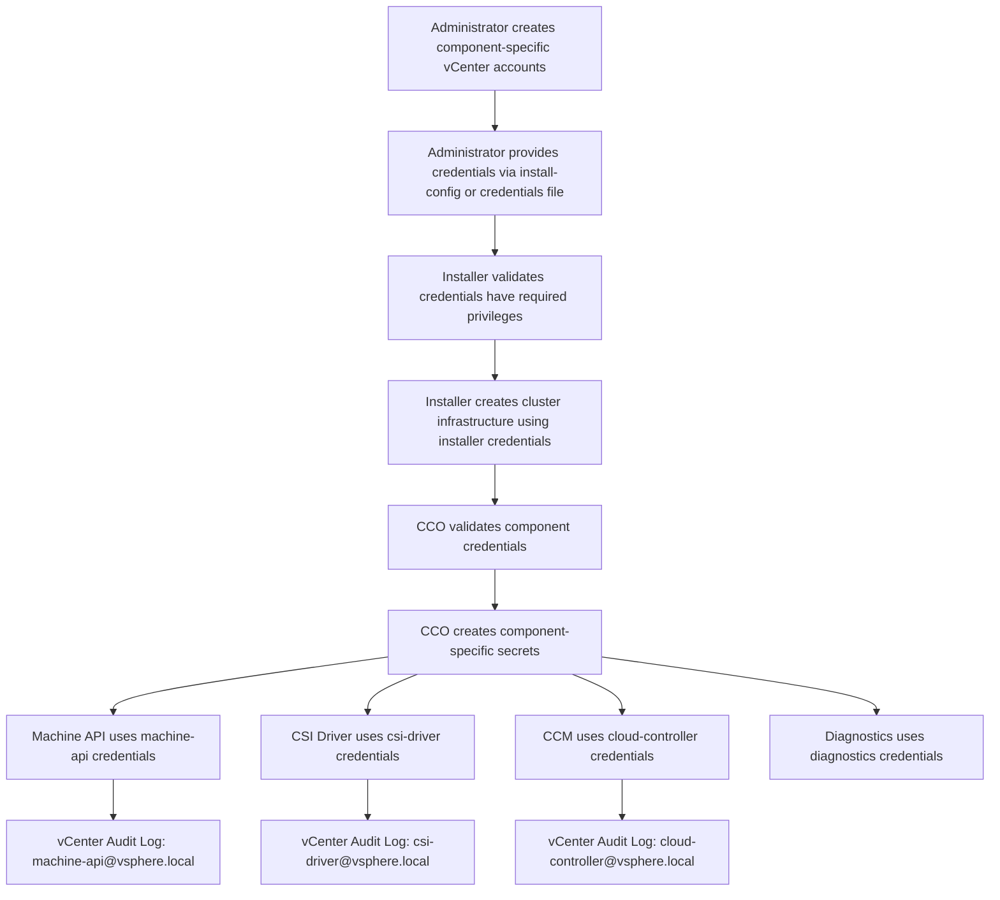
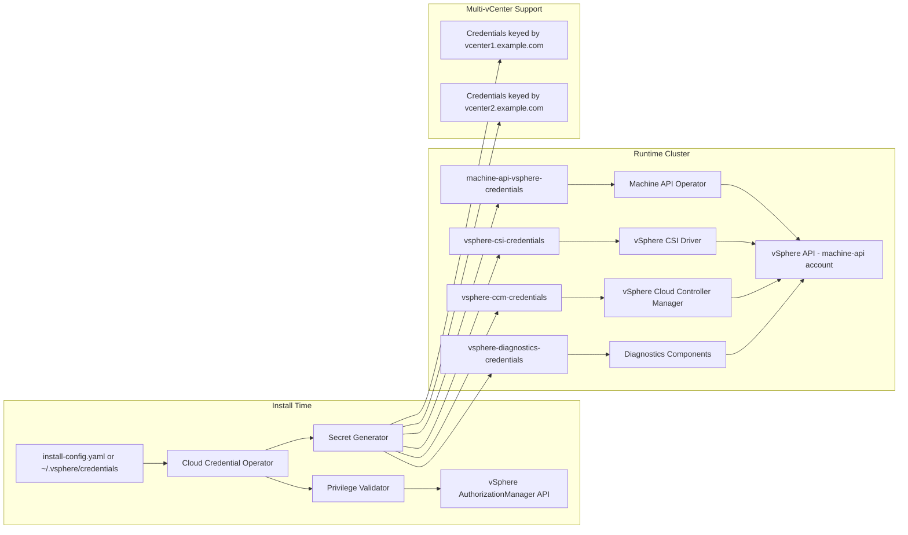

# Design: vSphere Multi-Account Credentials

**Epic:** #2  
**Status:** arch:design  
**Author:** superman (arch_designer)  
**Date:** 2026-04-13  
**Revision:** 2 (aligned with reference enhancement)

## Overview

This design implements per-component credential management for OpenShift vSphere deployments, enabling each OpenShift component (Machine API, CSI Driver, Cloud Controller Manager, Diagnostics) to use distinct vCenter credentials matched to its operational needs. This approach reduces the security blast radius by applying the principle of least privilege at the component level, improves auditability through component-specific vCenter usernames, and supports enterprise separation-of-duties requirements.

### Key Benefits

- **Component-Level Privilege Separation**: Each component receives only the vCenter permissions it needs
- **Reduced Blast Radius**: Compromised component credentials cannot affect other components' operations
- **Improved Auditability**: vCenter audit logs distinguish actions by component via separate usernames
- **Compliance**: Meets enterprise IAM requirements for separation of duties and least privilege
- **Independent Credential Rotation**: Update credentials for individual components without affecting others
- **Multi-vCenter Support**: Manage credentials per vCenter server in distributed topologies

### User Personas

- **Security Administrators**: Require strict IAM policies and blast radius reduction
- **Cloud Architects**: Need to migrate brownfield clusters to meet new hardened security standards
- **vSphere Infrastructure Teams**: Manage vCenter accounts through established provisioning processes

## Architecture

### High-Level Flow



### Component Architecture



## Components and Interfaces

### 1. Install Config Schema Extension

**Location**: `pkg/types/vsphere/platform.go`

**New Schema**:

```go
type Platform struct {
    // Existing fields...
    VCenter              string `json:"vCenter"`
    Username             string `json:"username"`             // Legacy single-account field (fallback)
    Password             string `json:"password"`             // Legacy single-account field (fallback)
    
    // NEW: Per-component credentials
    ComponentCredentials *ComponentCredentials `json:"componentCredentials,omitempty"`
}

type ComponentCredentials struct {
    // Per-component account credentials
    MachineAPI   *AccountCredentials `json:"machineAPI,omitempty"`
    CSIDriver    *AccountCredentials `json:"csiDriver,omitempty"`
    CloudController *AccountCredentials `json:"cloudController,omitempty"`
    Diagnostics  *AccountCredentials `json:"diagnostics,omitempty"`
    Installer    *AccountCredentials `json:"installer,omitempty"`
}

type AccountCredentials struct {
    Username string `json:"username"`
    Password string `json:"password"`
    VCenter  string `json:"vCenter,omitempty"` // Optional: override default vCenter for multi-vCenter topologies
}
```

**Validation Rules**:
- If `ComponentCredentials` is provided, at least one component account MUST be specified
- If `ComponentCredentials.Installer` is set, it is used for installation; otherwise fallback to legacy `Username`/`Password`
- Component accounts SHOULD use different usernames for auditability
- Each account's vCenter field can specify a different vCenter server (multi-vCenter support)

**Backward Compatibility**:
- Legacy `Username`/`Password` fields remain supported (passthrough mode)
- If only legacy fields are provided, all components use the same account
- If `ComponentCredentials` is partially populated, unpopulated components fall back to legacy credentials

### 2. Credentials File Support

**Location**: `~/.vsphere/credentials`

**File Format** (INI-style sections keyed by vCenter):

```ini
[vcenter1.example.com]
user = admin@vsphere.local
password = <password>
machine-api.user = ocp-machine-api@vsphere.local
machine-api.password = <password>
csi-driver.user = ocp-csi@vsphere.local
csi-driver.password = <password>
cloud-controller.user = ocp-ccm@vsphere.local
cloud-controller.password = <password>
diagnostics.user = ocp-diagnostics@vsphere.local
diagnostics.password = <password>

[vcenter2.example.com]
user = admin@vsphere.local
password = <password>
machine-api.user = ocp-machine-api@vsphere.local
machine-api.password = <password>
```

**File Permissions**:
- MUST be `0600` (read/write for owner only)
- Installer MUST refuse to process credentials file with permissions more permissive than `0600`

**Precedence**:
- `install-config.yaml` takes precedence over `~/.vsphere/credentials`
- If a component credential is not found in install-config, check credentials file
- If not found in credentials file, fall back to legacy passthrough mode

### 3. Privilege Validation

**Location**: `pkg/asset/installconfig/vsphere/privilegevalidator.go`

**Interface**:

```go
type PrivilegeValidator interface {
    ValidateComponentPrivileges(ctx context.Context, component string, creds *AccountCredentials, vCenter string) (*ValidationResult, error)
}

type ValidationResult struct {
    Valid             bool
    MissingPrivileges []string
    Scope             string // e.g., "Datacenter", "ResourcePool", "VM"
}
```

**Privilege Validation Strategy**:

Use vSphere `AuthorizationManager.FetchUserPrivilegeOnEntities()` API to check required privileges:

```go
func (v *PrivilegeValidator) ValidateComponentPrivileges(ctx context.Context, component string, creds *AccountCredentials, vCenterFQDN string) (*ValidationResult, error) {
    client := vsphere.NewClient(vCenterFQDN, creds.Username, creds.Password)
    
    requiredPrivileges := GetRequiredPrivileges(component)
    
    authManager := object.NewAuthorizationManager(client.Client)
    
    // Fetch user privileges on target entities (Datacenter, Cluster, ResourcePool, etc.)
    userPrivileges, err := authManager.FetchUserPrivilegeOnEntities(ctx, entities, creds.Username)
    if err != nil {
        return nil, err
    }
    
    missing := []string{}
    for _, required := range requiredPrivileges {
        if !contains(userPrivileges, required) {
            missing = append(missing, required)
        }
    }
    
    return &ValidationResult{
        Valid:             len(missing) == 0,
        MissingPrivileges: missing,
    }, nil
}
```

**Required Privileges Per Component**:

| Component | Privilege Count | Key Privileges |
|-----------|-----------------|----------------|
| **Installer** | ~45 | Full deployment operations: Folder.Create, ResourcePool.Create, VirtualMachine.Provisioning.*, Network.Assign, Datastore.AllocateSpace |
| **Machine API** | ~35 | VM lifecycle operations: VirtualMachine.Provisioning.*, VirtualMachine.Config.*, VirtualMachine.Interact.PowerOn, ResourcePool.AssignVApp |
| **CSI Driver** | ~10-15 | Storage provisioning: Datastore.AllocateSpace, Datastore.FileManagement, VirtualMachine.Config.AddNewDisk, VirtualMachine.Config.RemoveDisk |
| **Cloud Controller Manager** | ~10 | Read-only node discovery: System.Anonymous, System.Read, System.View |
| **Diagnostics** | ~5 | Read-only troubleshooting: System.Anonymous, System.Read, VirtualMachine.Provisioning.GetVmFiles |

(Full privilege lists MUST be maintained in documentation and code constants)

### 4. CCO Integration

**Location**: `pkg/cloudcredential/vsphere/actuator.go` (CCO repository)

**CCO Responsibilities**:

1. **Credential Validation**: Validate each component's credentials have required privileges
2. **Secret Distribution**: Create component-specific secrets in appropriate namespaces
3. **Multi-vCenter Handling**: Key credentials by vCenter FQDN within secrets
4. **Fallback Mode**: If per-component credentials unavailable, fall back to passthrough mode

**CCO Workflow**:

```go
func (a *Actuator) CreateOrUpdateCredentials(ctx context.Context) error {
    // Read component credentials from install-config or credentials file
    componentCreds := a.readComponentCredentials()
    
    // Validate each component's credentials
    for component, creds := range componentCreds {
        result, err := a.privilegeValidator.ValidateComponentPrivileges(ctx, component, creds, creds.VCenter)
        if err != nil {
            return fmt.Errorf("failed to validate %s credentials: %w", component, err)
        }
        if !result.Valid {
            return fmt.Errorf("%s credentials missing privileges: %v", component, result.MissingPrivileges)
        }
    }
    
    // Create component-specific secrets
    if err := a.createMachineAPISecret(componentCreds.MachineAPI); err != nil {
        return err
    }
    if err := a.createCSISecret(componentCreds.CSIDriver); err != nil {
        return err
    }
    if err := a.createCCMSecret(componentCreds.CloudController); err != nil {
        return err
    }
    if err := a.createDiagnosticsSecret(componentCreds.Diagnostics); err != nil {
        return err
    }
    
    return nil
}
```

### 5. Component Secret Generation

**Location**: `pkg/asset/manifests/vsphere.go`

**Secret Naming Convention**:

| Component | Secret Name | Namespace |
|-----------|-------------|-----------|
| Machine API | `machine-api-vsphere-credentials` | `openshift-machine-api` |
| CSI Driver | `vsphere-csi-credentials` | `openshift-cluster-csi-drivers` |
| Cloud Controller Manager | `vsphere-ccm-credentials` | `openshift-cloud-controller-manager` |
| Diagnostics | `vsphere-diagnostics-credentials` | `openshift-config` |

**Multi-vCenter Secret Format**:

For multi-vCenter topologies, secrets include vCenter FQDN keys:

```yaml
apiVersion: v1
kind: Secret
metadata:
  name: machine-api-vsphere-credentials
  namespace: openshift-machine-api
type: Opaque
data:
  vcenter1.example.com.username: <base64-encoded>
  vcenter1.example.com.password: <base64-encoded>
  vcenter2.example.com.username: <base64-encoded>
  vcenter2.example.com.password: <base64-encoded>
```

**Single vCenter Secret Format**:

For single vCenter deployments:

```yaml
apiVersion: v1
kind: Secret
metadata:
  name: machine-api-vsphere-credentials
  namespace: openshift-machine-api
type: Opaque
data:
  username: <base64-encoded>
  password: <base64-encoded>
```

### 6. Migration Tooling

**Location**: `cmd/openshift-install/migrate.go` (new command)

**Command Interface**:

```bash
openshift-install vsphere migrate-to-per-component \
  --kubeconfig=/path/to/kubeconfig \
  --credentials-file=~/.vsphere/credentials \
  --validate-privileges
```

**Migration Steps**:

1. Read per-component credentials from credentials file or install-config
2. Validate each component's credentials have required privileges (via CCO validation logic)
3. Create component-specific secrets in appropriate namespaces
4. Update CCO configuration to enable per-component mode
5. Restart component operators to pick up new credentials (Machine API, CSI, CCM)
6. Verify each component reconnects successfully
7. Log migration completion

**Rollback Strategy**:
- Keep backup of original passthrough-mode secret
- If any component fails to connect, restore original secret and CCO configuration
- Provide detailed error messages indicating which component failed and why

### 7. Administrator Automation Scripts

**Location**: `docs/vsphere/scripts/`

**govc-based Role Creation**:

```bash
#!/bin/bash
# create-component-roles.sh
# Creates vCenter roles for OpenShift components across multiple vCenters

VCENTERS=("vcenter1.example.com" "vcenter2.example.com")

for vcenter in "${VCENTERS[@]}"; do
    export GOVC_URL="$vcenter"
    export GOVC_USERNAME="administrator@vsphere.local"
    export GOVC_PASSWORD="<password>"
    
    # Create Machine API role
    govc role.create openshift-machine-api \
        VirtualMachine.Provisioning.DeployTemplate \
        VirtualMachine.Provisioning.Clone \
        VirtualMachine.Config.AddNewDisk \
        VirtualMachine.Config.RemoveDisk \
        VirtualMachine.Interact.PowerOn \
        VirtualMachine.Interact.PowerOff \
        ResourcePool.AssignVApp \
        # ... (35 total privileges)
    
    # Create CSI Driver role
    govc role.create openshift-csi-driver \
        Datastore.AllocateSpace \
        Datastore.FileManagement \
        VirtualMachine.Config.AddNewDisk \
        VirtualMachine.Config.RemoveDisk \
        # ... (10-15 total privileges)
    
    # Create Cloud Controller Manager role
    govc role.create openshift-cloud-controller \
        System.Anonymous \
        System.Read \
        System.View \
        # ... (10 total privileges)
    
    # Create Diagnostics role
    govc role.create openshift-diagnostics \
        System.Anonymous \
        System.Read \
        VirtualMachine.Provisioning.GetVmFiles \
        # ... (5 total privileges)
    
    echo "Roles created on $vcenter"
done
```

**PowerCLI Templates** (Windows-compatible):

```powershell
# create-component-roles.ps1
# Creates vCenter roles using PowerCLI

$vCenters = @("vcenter1.example.com", "vcenter2.example.com")

foreach ($vcenter in $vCenters) {
    Connect-VIServer -Server $vcenter -User "administrator@vsphere.local" -Password "<password>"
    
    # Create Machine API role
    New-VIRole -Name "openshift-machine-api" -Privilege @(
        "VirtualMachine.Provisioning.DeployTemplate",
        "VirtualMachine.Provisioning.Clone",
        # ... (35 total privileges)
    )
    
    # Create CSI Driver role
    New-VIRole -Name "openshift-csi-driver" -Privilege @(
        "Datastore.AllocateSpace",
        # ... (10-15 total privileges)
    )
    
    # ... (create other roles)
    
    Disconnect-VIServer -Server $vcenter -Confirm:$false
}
```

**Credentials File Generator**:

```bash
#!/bin/bash
# generate-credentials-file.sh
# Generates template credentials file with proper permissions

cat > ~/.vsphere/credentials << 'EOF'
[vcenter1.example.com]
user = installer@vsphere.local
password = <installer-password>
machine-api.user = ocp-machine-api@vsphere.local
machine-api.password = <machine-api-password>
csi-driver.user = ocp-csi@vsphere.local
csi-driver.password = <csi-password>
cloud-controller.user = ocp-ccm@vsphere.local
cloud-controller.password = <ccm-password>
diagnostics.user = ocp-diagnostics@vsphere.local
diagnostics.password = <diagnostics-password>
EOF

chmod 0600 ~/.vsphere/credentials
echo "Credentials file created at ~/.vsphere/credentials with 0600 permissions"
```

## Data Models

### Install Config YAML Example (Per-Component Mode)

```yaml
apiVersion: v1
baseDomain: example.com
metadata:
  name: vsphere-per-component
platform:
  vsphere:
    vCenter: vcenter1.example.com
    datacenter: DC1
    defaultDatastore: datastore1
    componentCredentials:
      installer:
        username: installer@vsphere.local
        password: <installer-password>
      machineAPI:
        username: ocp-machine-api@vsphere.local
        password: <machine-api-password>
      csiDriver:
        username: ocp-csi@vsphere.local
        password: <csi-password>
      cloudController:
        username: ocp-ccm@vsphere.local
        password: <ccm-password>
      diagnostics:
        username: ocp-diagnostics@vsphere.local
        password: <diagnostics-password>
```

### Install Config YAML Example (Multi-vCenter Mode)

```yaml
apiVersion: v1
baseDomain: example.com
metadata:
  name: vsphere-multi-vcenter
platform:
  vsphere:
    vCenter: vcenter1.example.com  # Default vCenter
    datacenter: DC1
    defaultDatastore: datastore1
    componentCredentials:
      installer:
        username: installer@vsphere.local
        password: <installer-password>
      machineAPI:
        username: ocp-machine-api@vsphere.local
        password: <machine-api-password>
        vCenter: vcenter1.example.com
      csiDriver:
        username: ocp-csi@vsphere.local
        password: <csi-password>
        vCenter: vcenter2.example.com  # CSI uses different vCenter
      cloudController:
        username: ocp-ccm@vsphere.local
        password: <ccm-password>
```

### Install Config YAML Example (Legacy Passthrough Mode)

```yaml
apiVersion: v1
baseDomain: example.com
metadata:
  name: vsphere-legacy
platform:
  vsphere:
    vCenter: vcenter.example.com
    datacenter: DC1
    defaultDatastore: datastore1
    username: vsphere-admin@vsphere.local
    password: <password>
```

### Credentials File Example

```ini
[vcenter1.example.com]
user = installer@vsphere.local
password = <installer-password>
machine-api.user = ocp-machine-api@vsphere.local
machine-api.password = <machine-api-password>
csi-driver.user = ocp-csi@vsphere.local
csi-driver.password = <csi-password>
cloud-controller.user = ocp-ccm@vsphere.local
cloud-controller.password = <ccm-password>
diagnostics.user = ocp-diagnostics@vsphere.local
diagnostics.password = <diagnostics-password>

[vcenter2.example.com]
user = installer@vsphere.local
password = <installer-password>
machine-api.user = ocp-machine-api@vsphere.local
machine-api.password = <machine-api-password>
```

## Error Handling

### Validation Errors

| Error Condition | Error Message | User Action |
|----------------|---------------|-------------|
| Credentials file permissions too permissive | "Credentials file ~/.vsphere/credentials has permissions <perms>, must be 0600" | Run `chmod 0600 ~/.vsphere/credentials` |
| ComponentCredentials provided but all fields empty | "ComponentCredentials specified but no component accounts provided" | Provide at least one component account |
| Component account missing required privilege | "Component <component> missing required privilege: <privilege> on <scope>" | Grant privilege or assign role with privilege |
| AuthorizationManager API call fails | "Failed to validate privileges for <component>: <error>" | Verify vCenter connectivity and credentials |
| Multi-vCenter credential missing for referenced vCenter | "Component <component> references vCenter <vcenter> but no credentials provided" | Provide credentials for all referenced vCenters |

### Installation Errors

| Error Condition | Error Message | Recovery |
|----------------|---------------|----------|
| Installer account lacks deployment privileges | "Installer account missing required privilege: <privilege>" | Grant privilege or use different account |
| CCO privilege validation fails | "Cloud Credential Operator failed to validate <component> credentials" | Check CCO logs, verify account privileges |
| Component fails to authenticate | "Component <component> failed to authenticate with vCenter <vcenter>" | Verify username/password, check vCenter connectivity |

### Migration Errors

| Error Condition | Error Message | Recovery |
|----------------|---------------|----------|
| Component account lacks required privileges | "Migration failed: <component> account missing privilege: <privilege>" | Grant required privileges, retry migration |
| Component operator fails to restart | "Component <component> operator failed to restart. Manual intervention required." | Check operator logs, restart manually |
| Component fails to reconnect after migration | "Component <component> failed to reconnect with new credentials" | Rollback to original credentials, investigate |

## Acceptance Criteria

### AC1: Per-Component Installation (Greenfield)

**Given** a user provides an install-config.yaml with `componentCredentials` containing accounts for installer, machineAPI, csiDriver, cloudController, and diagnostics  
**When** the installer runs  
**Then** the installer validates each component's credentials have required privileges  
**And** the installer uses the installer account to create infrastructure  
**And** CCO creates component-specific secrets with appropriate credentials  
**And** Machine API uses machine-api credentials  
**And** CSI Driver uses csi-driver credentials  
**And** Cloud Controller Manager uses cloud-controller credentials  
**And** Diagnostics uses diagnostics credentials  
**And** vCenter event logs show distinct usernames for each component's actions

### AC2: Legacy Passthrough Installation (Backward Compatibility)

**Given** a user provides an install-config.yaml with only legacy `username` and `password` fields  
**When** the installer runs  
**Then** the installer uses the legacy account for all operations  
**And** all components use the same credentials (passthrough mode)  
**And** installation completes without errors

### AC3: Credentials File Support

**Given** a user creates a credentials file at `~/.vsphere/credentials` with per-component credentials and 0600 permissions  
**When** the installer runs  
**Then** the installer reads component credentials from the credentials file  
**And** validates privileges for each component  
**And** creates component-specific secrets  
**And** installation proceeds using per-component credentials

**Given** a user creates a credentials file with permissions 0644  
**When** the installer runs  
**Then** validation fails with error "Credentials file ~/.vsphere/credentials has permissions 0644, must be 0600"

### AC4: Privilege Validation

**Given** a user provides machine-api credentials lacking VirtualMachine.Provisioning.Clone privilege  
**When** the installer validates privileges  
**Then** validation fails with error "Component machine-api missing required privilege: VirtualMachine.Provisioning.Clone on Datacenter"

**Given** a user provides csi-driver credentials lacking Datastore.AllocateSpace privilege  
**When** the installer validates privileges  
**Then** validation fails with error "Component csi-driver missing required privilege: Datastore.AllocateSpace on Datastore"

### AC5: Multi-vCenter Support

**Given** a user provides install-config.yaml with componentCredentials referencing two different vCenters  
**When** the installer runs  
**Then** the installer validates credentials for each vCenter  
**And** component secrets contain credentials keyed by vCenter FQDN  
**And** components connect to their respective vCenters using appropriate credentials

### AC6: Brownfield Migration

**Given** an existing cluster using legacy passthrough mode with a single high-privilege account  
**When** an administrator runs `openshift-install vsphere migrate-to-per-component` with a credentials file  
**Then** the migration tool validates each component's credentials  
**And** creates component-specific secrets in appropriate namespaces  
**And** restarts component operators to pick up new credentials  
**And** Machine API, CSI, CCM, and Diagnostics reconnect successfully  
**And** cluster operations (VM creation, PV provisioning, node discovery) succeed with per-component credentials

### AC7: Fallback to Passthrough Mode

**Given** a user provides install-config.yaml with partial componentCredentials (only machineAPI specified)  
**When** the installer runs  
**Then** components without specific credentials fall back to legacy username/password (passthrough mode)  
**And** Machine API uses machine-api credentials  
**And** CSI, CCM, and Diagnostics use legacy credentials  
**And** installation completes successfully

### AC8: Security - Component Credential Isolation

**Given** a per-component installation completes successfully  
**When** an administrator inspects the cluster's secrets  
**Then** the machine-api-vsphere-credentials secret contains only machine-api credentials  
**And** the vsphere-csi-credentials secret contains only csi-driver credentials  
**And** the vsphere-ccm-credentials secret contains only cloud-controller credentials  
**And** the vsphere-diagnostics-credentials secret contains only diagnostics credentials  
**And** no component can access another component's credentials

## Impact on Existing System

### Installer

- **Schema Change**: New optional `ComponentCredentials` field in `Platform` struct (backward compatible)
- **Credentials File Reader**: New logic to parse `~/.vsphere/credentials` file
- **Validation Logic**: New privilege validator using `AuthorizationManager.FetchUserPrivilegeOnEntities()`
- **Secret Generation**: Modified to create component-specific secrets based on componentCredentials (backward compatible)
- **Infrastructure Engine**: Uses installer credentials if provided, otherwise falls back to legacy credentials

### Cloud Credential Operator (CCO)

- **Privilege Validation**: New logic to validate component credentials against required privileges
- **Secret Distribution**: New logic to create component-specific secrets in appropriate namespaces
- **Multi-vCenter Support**: New logic to key credentials by vCenter FQDN
- **Fallback Mode**: Passthrough mode when componentCredentials not provided

### Machine API Operator

- **Secret Reading**: Modified to read from `machine-api-vsphere-credentials` secret (new namespace-specific secret)
- **Multi-vCenter Support**: Read credentials keyed by vCenter FQDN for multi-vCenter topologies
- **Fallback**: If component-specific secret not found, fall back to legacy secret

### vSphere CSI Driver

- **Secret Reading**: Modified to read from `vsphere-csi-credentials` secret
- **Multi-vCenter Support**: Read credentials keyed by vCenter FQDN
- **Reduced Permissions**: Operates with CSI-specific privileges (~10-15) instead of full admin privileges

### vSphere Cloud Controller Manager (CCM)

- **Secret Reading**: Modified to read from `vsphere-ccm-credentials` secret
- **Multi-vCenter Support**: Read credentials keyed by vCenter FQDN
- **Reduced Permissions**: Operates with read-only privileges (~10) for node discovery

### Diagnostics Components

- **Secret Reading**: Modified to read from `vsphere-diagnostics-credentials` secret
- **Reduced Permissions**: Operates with read-only privileges (~5) for troubleshooting

### Assisted Installer

- **UI Changes**: New form fields for per-component credentials
- **API Changes**: Support new install-config componentCredentials schema

### OpenShift Console

- **UI Changes**: Display current credential mode (passthrough vs per-component), migration warnings

### Existing Clusters (Brownfield)

- **Migration Path**: New CLI command for credential migration
- **Backward Compatibility**: Existing clusters continue to work in passthrough mode
- **Opt-In**: Migration is manual and opt-in

## Security Considerations

### 1. Credential Storage

**Risk**: Component credentials stored in cluster could be compromised  
**Mitigation**: 
- Each component's credentials are stored in separate secrets in component-specific namespaces
- Kubernetes RBAC limits access to component secrets
- Components can only access their own credentials, not other components' credentials
- Secrets are encrypted at rest if cluster encryption is enabled

**Risk**: Credentials in install-config.yaml or credentials file could be exposed in logs  
**Mitigation**: 
- Installer logs MUST redact password fields
- install-config.yaml should be deleted after installation or stored securely
- Credentials file MUST have 0600 permissions (enforced by installer)
- Documentation MUST warn users not to commit install-config.yaml or credentials file to version control

### 2. Privilege Separation

**Risk**: Component accounts have excessive privileges  
**Mitigation**: 
- Privilege validation checks required privileges per component
- Documentation provides minimal privilege templates for each component
- Administrator automation scripts create roles with precisely scoped privileges
- Regular permission audits recommended

**Risk**: Installer account persists in vCenter after installation  
**Mitigation**: 
- Documentation recommends disabling/deleting installer account after installation
- Installer logs reminder at installation completion

### 3. Blast Radius Reduction

**Risk**: Compromised Machine API credentials can affect other components  
**Mitigation**: 
- Machine API credentials isolated in separate secret
- Machine API privileges limited to VM lifecycle operations (~35 privileges)
- Cannot access storage operations (CSI), cannot read all objects (CCM), cannot access diagnostics
- Separate vCenter username enables audit trail isolation

**Risk**: Compromised CSI credentials can affect cluster infrastructure  
**Mitigation**: 
- CSI credentials limited to storage operations (~10-15 privileges)
- Cannot create/delete VMs (Machine API), cannot modify cluster configuration
- Blast radius limited to storage provisioning

**Risk**: Compromised CCM credentials can affect cluster operations  
**Mitigation**: 
- CCM credentials are read-only (~10 privileges)
- Cannot modify vCenter objects, only read node information
- Minimal blast radius (information disclosure only)

### 4. Credential Rotation

**Risk**: Component credentials become stale or compromised  
**Mitigation**: 
- Migration tool supports independent credential rotation per component
- CCO integration allows credential rotation without cluster downtime
- Documentation provides rotation procedures per component
- Components can be rotated independently without affecting others

### 5. Authentication Failures

**Risk**: Invalid component credentials block cluster operations  
**Mitigation**: 
- Validation during installation tests component authentication
- Privilege validation verifies required permissions before proceeding
- Migration tool validates new credentials before applying changes
- Rollback mechanism in migration tool restores original credentials on failure

### 6. Audit Trail

**Risk**: Cannot distinguish component actions in vCenter audit logs  
**Mitigation**: 
- Separate usernames for each component ensure distinct audit trails
- vCenter events show which component performed which action
- Documentation recommends descriptive usernames (e.g., `openshift-machine-api`, `openshift-csi`)

### 7. Multi-vCenter Security

**Risk**: Credentials for one vCenter could be used on another  
**Mitigation**: 
- Credentials keyed by vCenter FQDN in secrets
- Components validate vCenter FQDN before connecting
- Privilege validation performed per vCenter

### 8. Compliance

**Benefit**: Per-component credential mode supports compliance requirements:
- Principle of least privilege (each component has minimal privileges)
- Separation of duties (installer vs runtime components)
- Audit trail (distinct usernames per component)
- Independent credential lifecycle management

---

**Design Complete**  
**Next Phase**: lead:design-review
