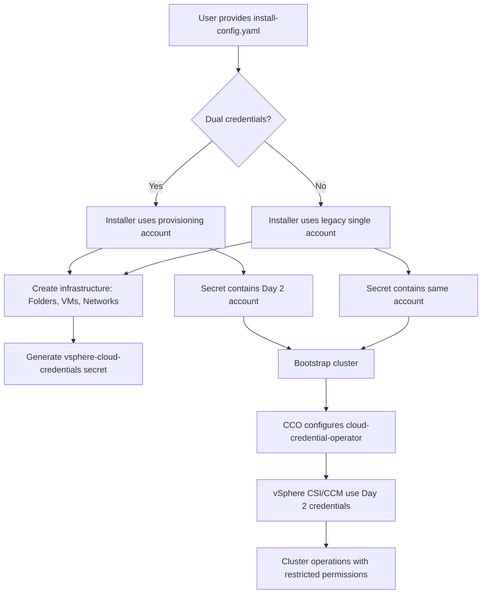
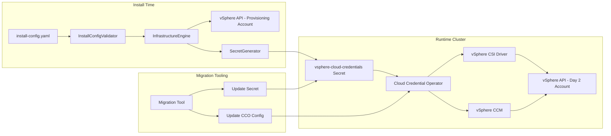

# Design: vSphere Multi-Account Credentials

**Epic:** #2  
**Status:** arch:design  
**Author:** superman (arch_designer)  
**Date:** 2026-04-13

## Overview

This design implements dual-credential support for OpenShift vSphere installations, enabling separation of high-privileged "provisioning" credentials (used during cluster creation) from restricted "Day 2" operational credentials (used by the running cluster). This reduces the security blast radius by ensuring that a compromised cluster cannot delete or modify the entire vSphere datacenter infrastructure.

### Key Benefits

- **Privilege Separation**: High-privilege credentials only used during installation, not stored in the running cluster
- **Compliance**: Meets enterprise IAM requirements for least-privilege access
- **Auditability**: Separate vCenter usernames distinguish installer actions from cluster operator actions
- **Migration Support**: Existing clusters can upgrade from single-account to dual-account configuration

### User Personas

- **Security Administrators**: Require strict IAM policies and blast radius reduction
- **Cloud Architects**: Need to migrate brownfield clusters to meet new hardened security standards

## Architecture

### High-Level Flow



### Component Architecture



## Components and Interfaces

### 1. Install Config Schema Extension

**Location**: `pkg/types/vsphere/platform.go`

**New Schema**:

```go
type Platform struct {
    // Existing fields...
    VCenter              string `json:"vCenter"`
    Username             string `json:"username"`             // Legacy single-account field
    Password             string `json:"password"`             // Legacy single-account field
    
    // NEW: Dual-credential fields
    ProvisioningAccount  *AccountCredentials `json:"provisioningAccount,omitempty"`
    OperationalAccount   *AccountCredentials `json:"operationalAccount,omitempty"`
}

type AccountCredentials struct {
    Username string `json:"username"`
    Password string `json:"password"`
}
```

**Validation Rules**:
- If `ProvisioningAccount` is set, `OperationalAccount` MUST also be set
- If `ProvisioningAccount` is set, legacy `Username`/`Password` fields MUST NOT be set
- Usernames for provisioning and operational accounts MUST be different

**Backward Compatibility**:
- Legacy `Username`/`Password` fields remain supported
- If only legacy fields are provided, behavior is unchanged (single-account mode)

### 2. Credential Validator

**Location**: `pkg/asset/installconfig/vsphere/credentials.go`

**Interface**:

```go
type CredentialValidator interface {
    ValidateProvisioningAccount(ctx context.Context, creds *AccountCredentials) error
    ValidateOperationalAccount(ctx context.Context, creds *AccountCredentials) error
}
```

**Required Permissions Check**:

**Provisioning Account** (High-privilege):
- vCenter: Create/delete folders, resource pools
- Network: Assign VMs to networks
- Datastore: Create/delete VM files
- Compute: Create/delete VMs, modify VM configuration

**Operational Account** (Restricted):
- vCenter: Read-only on folders/resource pools
- Compute: Power on/off VMs, read VM configuration
- Datastore: Create/delete virtual disks (for CSI PV operations)
- Network: Read-only

**Validation Strategy**:
- Attempt dry-run operations (e.g., create temporary folder, then delete)
- Return detailed error if permissions missing
- Log permission validation results

### 3. Secret Generation

**Location**: `pkg/asset/manifests/vsphere.go`

**Modified Logic**:

```go
func generateVSphereCloudCredentialsSecret(platform *vsphere.Platform) *corev1.Secret {
    var username, password string
    
    if platform.OperationalAccount != nil {
        // Dual-credential mode: use Day 2 account
        username = platform.OperationalAccount.Username
        password = platform.OperationalAccount.Password
    } else {
        // Legacy mode: use single account
        username = platform.Username
        password = platform.Password
    }
    
    return &corev1.Secret{
        ObjectMeta: metav1.ObjectMeta{
            Name:      "vsphere-cloud-credentials",
            Namespace: "kube-system",
        },
        Type: corev1.SecretTypeOpaque,
        Data: map[string][]byte{
            "username": []byte(username),
            "password": []byte(password),
        },
    }
}
```

**Security Consideration**: The provisioning account credentials MUST NOT be stored in the generated secret.

### 4. Infrastructure Engine

**Location**: `pkg/asset/machines/vsphere/machines.go`

**Modified Logic**:

```go
func (m *MachineBuilder) createInfrastructure() error {
    var provCreds *AccountCredentials
    
    if m.platform.ProvisioningAccount != nil {
        provCreds = m.platform.ProvisioningAccount
    } else {
        // Legacy mode: use single account
        provCreds = &AccountCredentials{
            Username: m.platform.Username,
            Password: m.platform.Password,
        }
    }
    
    // Use provisioning credentials for infrastructure creation
    client := vsphere.NewClient(m.platform.VCenter, provCreds.Username, provCreds.Password)
    
    // Create folders, resource pools, VMs, etc.
    return m.provisionResources(client)
}
```

### 5. Migration Tooling

**Location**: `cmd/openshift-install/migrate.go` (new command)

**Command Interface**:

```bash
openshift-install vsphere migrate-credentials \
  --kubeconfig=/path/to/kubeconfig \
  --operational-username=vsphere-day2@vsphere.local \
  --operational-password=<password> \
  --validate-permissions
```

**Migration Steps**:

1. Validate operational account permissions (dry-run operations)
2. Update `vsphere-cloud-credentials` secret in `kube-system` namespace
3. Restart cloud-credential-operator pods to pick up new credentials
4. Verify CCM and CSI drivers reconnect with new credentials
5. Log migration completion

**Rollback Strategy**:
- Keep backup of original secret
- If CSI/CCM fail to connect, restore original secret

### 6. UI Integration - Assisted Installer

**Location**: Assisted Installer frontend (separate repo)

**UI Changes**:

1. Add radio button: "Single Account" (default) vs. "Dual Account (Recommended)"
2. If "Dual Account" selected:
   - Show "Provisioning Account" section (username/password fields)
   - Show "Operational Account" section (username/password fields)
   - Add help text: "Provisioning account will be used only during installation. Operational account will be stored in the cluster."
3. Validate: usernames must be different

**API Payload**:

```json
{
  "platform": {
    "vsphere": {
      "vCenter": "vcenter.example.com",
      "provisioningAccount": {
        "username": "vsphere-provisioner@vsphere.local",
        "password": "<redacted>"
      },
      "operationalAccount": {
        "username": "vsphere-day2@vsphere.local",
        "password": "<redacted>"
      }
    }
  }
}
```

### 7. UI Integration - OpenShift Console

**Location**: OpenShift Console (separate repo)

**Changes**: 
- Read-only display of current credential mode in vSphere configuration page
- Display warning if cluster is using legacy single-account mode
- Link to migration documentation

## Data Models

### Install Config YAML Example (Dual-Credential Mode)

```yaml
apiVersion: v1
baseDomain: example.com
metadata:
  name: vsphere-dual-creds
platform:
  vsphere:
    vCenter: vcenter.example.com
    datacenter: DC1
    defaultDatastore: datastore1
    provisioningAccount:
      username: vsphere-provisioner@vsphere.local
      password: <high-privilege-password>
    operationalAccount:
      username: vsphere-day2@vsphere.local
      password: <restricted-password>
```

### Install Config YAML Example (Legacy Single-Account Mode)

```yaml
apiVersion: v1
baseDomain: example.com
metadata:
  name: vsphere-legacy
platform:
  vsphere:
    vCenter: vcenter.example.com
    datacenter: DC1
    defaultDatastore: datastore1
    username: vsphere-admin@vsphere.local
    password: <password>
```

### vsphere-cloud-credentials Secret (Generated)

```yaml
apiVersion: v1
kind: Secret
metadata:
  name: vsphere-cloud-credentials
  namespace: kube-system
type: Opaque
data:
  username: <base64-encoded-day2-username>
  password: <base64-encoded-day2-password>
```

## Error Handling

### Validation Errors

| Error Condition | Error Message | User Action |
|----------------|---------------|-------------|
| ProvisioningAccount set but OperationalAccount missing | "OperationalAccount is required when ProvisioningAccount is specified" | Provide both accounts |
| Legacy username/password set with new dual-credential fields | "Cannot use both legacy username/password and provisioningAccount/operationalAccount" | Choose one mode |
| Same username for both accounts | "ProvisioningAccount and OperationalAccount must use different usernames" | Use distinct accounts |
| Provisioning account lacks permissions | "Provisioning account missing required permission: \<permission\>" | Grant missing permission |
| Operational account has excessive permissions | "WARNING: Operational account has high-privilege permissions. Consider restricting." | Review account permissions |

### Installation Errors

| Error Condition | Error Message | Recovery |
|----------------|---------------|----------|
| Provisioning account fails authentication | "Failed to authenticate with provisioning account: invalid credentials" | Verify username/password |
| Operational account fails authentication during secret generation | "Failed to validate operational account credentials" | Verify username/password |
| Infrastructure creation fails mid-way | "Installation failed at step \<step\>. Manual cleanup may be required." | Run cleanup script, retry |

### Migration Errors

| Error Condition | Error Message | Recovery |
|----------------|---------------|----------|
| Operational account lacks CSI permissions | "Migration failed: operational account cannot create virtual disks" | Grant required permissions, retry |
| CCO restart fails | "Cloud Credential Operator failed to restart. Manual intervention required." | Check operator logs, restart manually |
| CSI driver fails to reconnect | "CSI driver failed to authenticate with new credentials" | Rollback to original secret |

## Acceptance Criteria

### AC1: Dual-Credential Installation (Greenfield)

**Given** a user provides an install-config.yaml with both `provisioningAccount` and `operationalAccount`  
**When** the installer runs  
**Then** the installer uses the provisioning account to create infrastructure  
**And** the generated `vsphere-cloud-credentials` secret contains the operational account  
**And** the CSI driver and CCM use the operational account for runtime operations  
**And** vCenter event logs show distinct usernames for installer vs. cluster actions

### AC2: Legacy Single-Account Installation (Backward Compatibility)

**Given** a user provides an install-config.yaml with only legacy `username` and `password` fields  
**When** the installer runs  
**Then** the installer uses the single account for both infrastructure creation and runtime operations  
**And** the generated `vsphere-cloud-credentials` secret contains the same account  
**And** installation completes without errors

### AC3: Install Config Validation

**Given** a user provides an install-config.yaml with `provisioningAccount` but missing `operationalAccount`  
**When** the installer validates the config  
**Then** validation fails with error "OperationalAccount is required when ProvisioningAccount is specified"

**Given** a user provides an install-config.yaml with both legacy `username` and `provisioningAccount`  
**When** the installer validates the config  
**Then** validation fails with error "Cannot use both legacy username/password and provisioningAccount/operationalAccount"

**Given** a user provides an install-config.yaml with the same username for both accounts  
**When** the installer validates the config  
**Then** validation fails with error "ProvisioningAccount and OperationalAccount must use different usernames"

### AC4: Credential Permission Validation

**Given** a user provides a provisioning account lacking folder creation permissions  
**When** the installer validates permissions  
**Then** validation fails with error "Provisioning account missing required permission: Create Folder"

**Given** a user provides an operational account lacking virtual disk creation permissions  
**When** the installer validates permissions  
**Then** validation fails with error "Operational account missing required permission: Create Virtual Disk"

### AC5: Brownfield Migration

**Given** an existing cluster using a single high-privilege account  
**When** an administrator runs `openshift-install vsphere migrate-credentials` with a restricted operational account  
**Then** the `vsphere-cloud-credentials` secret is updated with the new operational account  
**And** the cloud-credential-operator restarts and picks up the new credentials  
**And** the CSI driver and CCM reconnect with the new credentials  
**And** cluster operations (PV creation, load balancer updates) succeed with the new account

### AC6: UI Integration - Assisted Installer

**Given** a user selects "Dual Account" mode in the Assisted Installer  
**When** the user provides provisioning and operational account credentials  
**Then** the Assisted Installer generates an install-config.yaml with `provisioningAccount` and `operationalAccount`  
**And** installation proceeds using the dual-credential flow

### AC7: Security - Provisioning Credentials Not Persisted

**Given** a dual-credential installation completes successfully  
**When** an administrator inspects the cluster's secrets and configmaps  
**Then** the provisioning account credentials are NOT found in any cluster resource  
**And** only the operational account credentials are present in `vsphere-cloud-credentials`

## Impact on Existing System

### Installer

- **Schema Change**: New optional fields in `Platform` struct (backward compatible)
- **Validation Logic**: New credential validator (additive)
- **Secret Generation**: Modified to select appropriate credentials based on mode (backward compatible)
- **Infrastructure Engine**: Modified to use provisioning credentials during install (backward compatible)

### Cloud Credential Operator (CCO)

- **No Changes Required**: CCO reads `vsphere-cloud-credentials` secret as before
- **Migration Only**: CCO pods restart during migration to pick up new credentials

### vSphere CSI Driver

- **No Changes Required**: CSI driver reads credentials from secret as before
- **Impact**: Uses operational account instead of provisioning account (reduced permissions)

### vSphere Cloud Controller Manager (CCM)

- **No Changes Required**: CCM reads credentials from secret as before
- **Impact**: Uses operational account instead of provisioning account (reduced permissions)

### Assisted Installer

- **UI Changes**: New form fields for dual-credential mode
- **API Changes**: Support new install-config schema

### OpenShift Console

- **UI Changes**: Display current credential mode, migration warnings

### Existing Clusters (Brownfield)

- **Migration Path**: New CLI command for credential migration
- **Backward Compatibility**: Existing clusters continue to work without changes
- **Opt-In**: Migration is manual and opt-in

## Security Considerations

### 1. Credential Storage

**Risk**: Provisioning credentials stored in cluster could be compromised  
**Mitigation**: Provisioning credentials are NEVER stored in the cluster. Only operational credentials are persisted in the `vsphere-cloud-credentials` secret.

**Risk**: Credentials in install-config.yaml could be exposed in logs  
**Mitigation**: 
- Installer logs MUST redact password fields
- install-config.yaml should be deleted after installation or stored securely
- Documentation MUST warn users not to commit install-config.yaml to version control

### 2. Privilege Escalation

**Risk**: Operational account permissions too broad  
**Mitigation**: 
- Validation logic checks operational account permissions and warns if excessive
- Documentation provides minimal permission templates for operational accounts
- Regular permission audits recommended

**Risk**: Provisioning account persists in vCenter after installation  
**Mitigation**: 
- Documentation recommends disabling/deleting provisioning account after installation
- Installer logs reminder at installation completion

### 3. Credential Rotation

**Risk**: Operational credentials become stale or compromised  
**Mitigation**: 
- Migration tool supports credential rotation
- CCO integration allows for credential rotation without cluster downtime
- Documentation provides rotation procedures

### 4. Authentication Failures

**Risk**: Invalid operational credentials block cluster operations  
**Mitigation**: 
- Validation during installation tests operational account authentication
- Migration tool validates new credentials before applying changes
- Rollback mechanism in migration tool restores original credentials on failure

### 5. Audit Trail

**Risk**: Cannot distinguish installer actions from cluster operator actions  
**Mitigation**: 
- Separate usernames ensure distinct audit trails in vCenter events
- Documentation recommends descriptive usernames (e.g., `openshift-provisioner`, `openshift-day2`)

### 6. Supply Chain Security

**Risk**: Malicious modification of credential handling code  
**Mitigation**: 
- Code review for all credential-handling changes
- Unit tests verify credentials are not logged
- Integration tests verify correct credential selection

### 7. Blast Radius Reduction

**Risk**: Compromised cluster can delete infrastructure  
**Mitigation**: 
- Operational account has read-only permissions on folders/resource pools
- Operational account cannot delete VMs (only power operations)
- Provisioning account not stored in cluster

### 8. Compliance

**Benefit**: Dual-credential mode supports compliance requirements:
- Principle of least privilege (operational account has minimal permissions)
- Separation of duties (provisioning vs. operations)
- Audit trail (distinct usernames)

---

**Design Complete**  
**Next Phase**: lead:design-review
